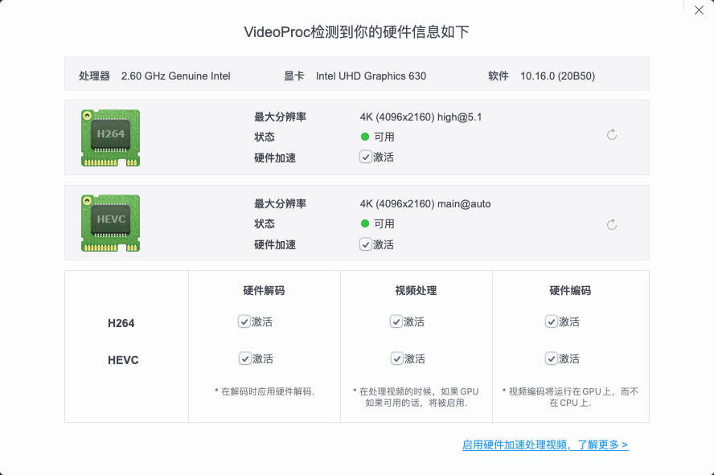

# 华硕 Z390-H 黑苹果Opencore
本EFI可在macOS Big Sur (11.0.1)上驱动。FCPX显卡渲染正常工作。HDR可正常开启。支持睡眠，隔空投送和接力。

Big Sur需要OpenCore 0.6.3，系统更新前请先更新EFI。

## 注意事项
1. 在Clover和OpenCore之间切换时请清除NVRAM。
3. 如果你没有独立显卡（核显输出），参考[这里](https://dortania.github.io/OpenCore-Desktop-Guide/config.plist/skylake.html#add_1)修改`/EFI/OC/config.plist` -> `DeviceProperties/Add/PciRoot(0x0)/Pci(0x2,0x0)`。

## 硬件
| 类别 | 品牌 | 型号 | 驱动 | 备注 |
|-----|-----|-----|-----|-----|
| 主板 | 华硕 | Z390-H | | |
| 处理器 | 英特尔 | i9-9900k（我用的是es版本的） |  | |
| 内存 | 酷兽 | 32GB DDR4 3200 |  | 2666超频到3200 |
| 核芯显卡 | 英特尔 | UHD630 | 免驱 | Headless模式 |
| 独立显卡 |  | RX 580 | 免驱 | 2304流处理器 |

